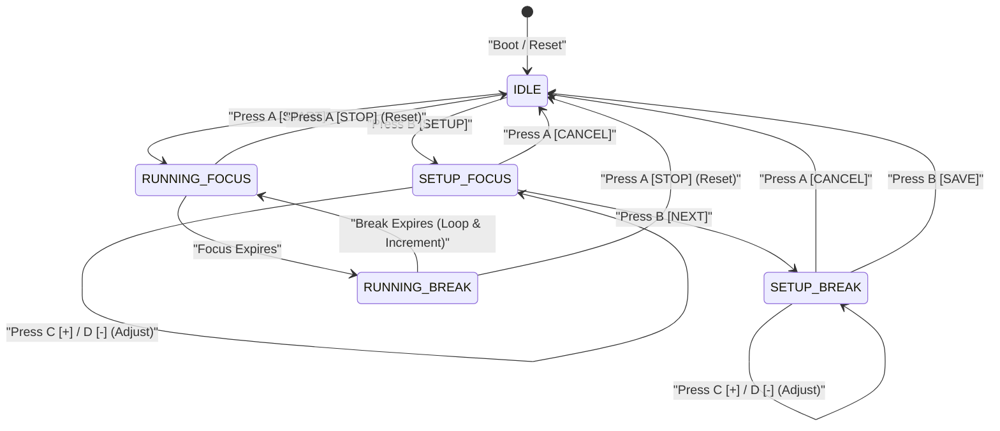

# Adafruit MagTag Focus Timer (CircuitPython 10)

A modern, highly optimized, and premium Focus Timer designed specifically for the **Adafruit MagTag** (2.9" E-ink display with ESP32-S2). It implements a robust state machine with customized audio soundscapes, live NeoPixel progress bars, and high-performance, battery-friendly E-ink screen refresh designs.

---

## 🚀 Key Features

*   **Dynamic Screen Button Labels**: The screen directly labels the physical buttons underneath, making the timer instantly intuitive and simple to operate in every state.
*   **Settings.toml Configuration**: Default times are stored in a standard `settings.toml` file at the root, allowing you to customize your setup instantly without touching Python code.
*   **1.0s Deferred Setup Refresh**: Setting durations (using UP and DOWN buttons) is extremely responsive. Audible clicks chirp instantly, while the screen update is delayed by `1.0s` of button inactivity, preventing annoying and power-draining E-ink refreshes on every tap.
*   **Once-per-Minute Timing Refresh**: While running, the E-ink screen only refreshes when the minute count actually changes, maximizing battery life and protecting screen health.
*   **Aesthetic NeoPixel Progress Bar**: Real-time visual progress is shown using the 4 built-in NeoPixel LEDs at low brightness. The current filling LED pulses dynamically using a smooth sine wave to show the timer is actively counting down.
*   **Pomodoro Cycle Counter & Continuous Looping**: Keeps track of completed cycles (a cycle is one completed Focus + Break loop). Instead of returning to IDLE after a break session completes, the timer automatically loops back to start a new Focus session, incrementing the cycle counter. This loop continues indefinitely until the user manually stops/aborts the active session with **Button A (`[STOP]`)**, which resets the cycle counter back to 0.
*   **Custom Audio Soundscapes**: Custom beep chimes distinguish between button clicks, cancellations, completed focus sessions, and break completions.

---

## 🕹️ Interface & State Machine

### 📊 State Transition Diagram

Below is the state machine flow showing boot, timing loops, setup triggers, and the manual stop cancellation cycle:



The Focus Timer operates across 5 core states. The 4 physical buttons (from left to right: **A, B, C, D**) dynamically change roles as shown below:

```
+-------------------------------------------------------+
|                   === FOCUS TIMER ===                 |
|                                                       |
|                     30 min remaining                  |
|                    [  Focus Mode  ]                   |
|                                                       |
| [  STOP  ]      [          ]      [      ]      [     ] |
+-------------------------------------------------------+
    Btn A            Btn B            Btn C         Btn D
 (Start/Stop)       (Setup)           (Up)         (Down)
```

### Button Mapping Table

| State | Button A | Button B | Button C | Button D |
| :--- | :--- | :--- | :--- | :--- |
| **`IDLE`** | `[START]` (Begins focus timer) | `[SETUP]` (Enters focus time setup) | *Inactive* | *Inactive* |
| **`SETUP_FOCUS`** | `[CANCEL]` (Returns to Idle) | `[NEXT]` (Saves and goes to Break setup) | `[  +  ]` (Add 1 min) | `[  -  ]` (Sub 1 min) |
| **`SETUP_BREAK`** | `[CANCEL]` (Returns to Idle) | `[SAVE]` (Saves times and returns to Idle) | `[  +  ]` (Add 1 min) | `[  -  ]` (Sub 1 min) |
| **`RUNNING_FOCUS`**| `[STOP]` (Cancels timer, Idle) | *Inactive* | *Inactive* | *Inactive* |
| **`RUNNING_BREAK`**| `[STOP]` (Cancels timer, Idle) | *Inactive* | *Inactive* | *Inactive* |

---

## 🎨 Visual Progress & Audio Alerts

### NeoPixel Animations
*   **Focus Setup Mode**: LEDs `0` and `1` light up solid red.
*   **Break Setup Mode**: LEDs `2` and `3` light up solid green.
*   **Active Countdown**: The 4 LEDs represent 25% quadrants of completion. Fully completed quadrants glow dimly, while the current active quadrant pulses with a warm sine-wave glow:
    *   **Focus Session**: Warm Orange/Red glowing progress bar.
    *   **Break Session**: Soft Teal/Green glowing progress bar.
*   **Idle Mode**: All NeoPixels turn off to save battery.

### Audio Chimes
*   **Tap Feedback**: Short, high click chirp (`1200 Hz` for `0.03s`).
*   **Cancel Alert**: Two descending tones (`1000 Hz` then `600 Hz`).
*   **Focus Completed**: A repeating, pleasant ascending arpeggio (`1500 Hz` -> `2000 Hz` -> `2500 Hz`) to alert you that it is time to rest.
*   **Break Completed**: A sweet dual chime (`1200 Hz` -> `1800 Hz`) to nudge you back to work.

---

## 📂 Required Folder Structure

To ensure CircuitPython 10 loads the scripts and libraries successfully, organize your `CIRCUITPY` drive as follows:

```
CIRCUITPY/              (Root USB Drive)
├── code.py             (Focus Timer core logic script)
├── settings.toml       (Configuration file for default durations)
└── lib/                (Libraries directory)
    ├── neopixel.mpy    (Handles NeoPixel LED control)
    ├── simpleio.mpy    (Handles speaker audio tone generation)
    ├── adafruit_ticks.mpy (Handles timing math in display helpers)
    ├── adafruit_requests.mpy (Handles HTTP client requests)
    ├── adafruit_fakerequests.mpy (Handles mock requests inside PortalBase)
    ├── adafruit_miniqr.mpy (Handles QR code display functions)
    ├── adafruit_magtag/
    │   ├── __init__.py
    │   └── magtag.py
    ├── adafruit_portalbase/
    │   ├── __init__.py
    │   └── ...
    ├── adafruit_display_text/
    │   ├── __init__.py
    │   └── ...
    ├── adafruit_bitmap_font/
    │   ├── __init__.py
    │   └── ...
    ├── adafruit_imageload/
    │   ├── __init__.py
    │   └── ...
    ├── adafruit_minimqtt/
    │   ├── __init__.py
    │   └── ...
    └── adafruit_io/
        ├── __init__.py
        └── ...
```

---

## ⚙️ Customizing Defaults via `settings.toml`

CircuitPython 10 natively reads environment configuration keys defined in `settings.toml` at the drive's root. You can edit this file using any basic text editor to set your desired start durations:

```toml
# Default durations in minutes for the Focus Timer
FOCUS_TIME = 30
BREAK_TIME = 10
```

If `settings.toml` is absent or the keys are missing, the program automatically defaults to a **30-minute focus** session and a **10-minute break** session.

---

## 💾 Library Dependencies Detailed

To run the program successfully under **CircuitPython 10**, you must copy specific library folders and `.mpy` files from the official library bundle into the `lib/` folder on your `CIRCUITPY` drive. 

Here is the complete, comprehensive list of all required libraries, detailing exactly why they are needed:

### 1. Core Code Dependencies

| Library Name / Path | Type | Purpose & Details |
| :--- | :--- | :--- |
| **`neopixel.mpy`** | File | **NeoPixel Controller**: Directly interacts with the WS2812B NeoPixel hardware. In this project, it powers the non-blocking progress bar, enabling completed quadrants to remain dimly lit while the current active LED pulses in a smooth sine-wave glow. |
| **`simpleio.mpy`** | File | **Speaker Tone Player**: Handles sound synthesis for microcontrollers. `adafruit_magtag.peripherals` imports this globally to drive the buzzer using `.play_tone()`, making it a core dependency for all Focus Timer alarm and click sounds. |
| **`adafruit_magtag/`** | Folder | **MagTag Board Abstraction**: The core helper designed specifically for the MagTag. It wraps all on-board components into simple, programmatic interfaces (like `.peripherals.buttons` and `.peripherals.play_tone`) and handles low-level power pins like `board.SPEAKER_ENABLE`. |
| **`adafruit_portalbase/`** | Folder | **Portal Platform Base**: The foundation library for all Adafruit "Portal" screens (MatrixPortal, PyPortal, and MagTag). It manages the background graphic rendering, E-ink refresh buffers, and high-level layout systems which `adafruit_magtag` inherits. |
| **`adafruit_display_text/`** | Folder | **E-ink Font Renderer**: Takes characters, wraps them based on bounding boxes, and plots them onto the screen. In this project, it displays the 6 dynamic layout labels (Header, Remaining Time, and the 4 button-prompt labels). |
| **`adafruit_bitmap_font/`** | Folder | **Font Loading Helper**: Although we utilize CircuitPython's built-in `terminalio.FONT` for text, `adafruit_magtag` imports this module internally to handle graphic layouts. Omitting it will result in a runtime `ImportError`. |
| **`adafruit_ticks.mpy`** | File | **Millisecond Timing Helper**: Provides high-efficiency millisecond timing math. In CircuitPython 9 and 10, display rendering libraries like `adafruit_display_text.bitmap_label` import and use this module internally for font and text layout timing, making it a critical dependency. |
| **`adafruit_imageload/`** | Folder | **Image Loading Helper**: Decodes and mounts bitmap (BMP) graphics for display. `adafruit_portalbase.graphics` imports this globally to manage screen background images, making it a required directory even when displaying only text labels. |

### 2. Transitive Network Dependencies (Optional but Bundled)
The following libraries are imported internally by standard `adafruit_magtag` wifi helpers. Although this Focus Timer project runs completely offline to maximize battery life, they must be copied into your `lib/` folder to prevent the Adafruit helper library from throwing dependency load errors during startup:

| Library Name / Path | Type | Purpose & Details |
| :--- | :--- | :--- |
| **`adafruit_miniqr.mpy`** | File | **QR Code Generator**: Included in the MagTag bundle to quickly display QR codes on the E-ink screen. |
| **`adafruit_requests.mpy`** | File | **HTTP Client**: Manages outbound API requests and handles internet data parsing for online widgets. |
| **`adafruit_fakerequests.mpy`** | File | **Mock Web Client**: Simulates online network requests for testing or offline graphics configurations inside `adafruit_portalbase`, making it necessary during startup loads. |
| **`adafruit_minimqtt/`** | Folder | **MQTT Networking**: Enables publishing and subscribing to data feeds (e.g., Adafruit IO dashboards). |
| **`adafruit_io/`** | Folder | **Adafruit IO Client**: The dedicated wrapper to feed data directly to and from Adafruit cloud endpoints. |

---

## 🔌 Running & Deploying

### 1. Connecting the Device
1. Connect your Adafruit MagTag to your computer using a USB-C cable.
2. The board will mount as a USB flash drive named **`CIRCUITPY`**.

### 2. Preparing the Libraries
1. Download the **CircuitPython 10.x Library Bundle** from [circuitpython.org/libraries](https://circuitpython.org/libraries).
2. Copy all the libraries listed in the **Library Dependencies Detailed** section above from the bundle into the `lib/` directory of your `CIRCUITPY` drive.

### 3. Copying the Core Code
1. Copy **[`code.py`](file:///c:/AI_Projects/Focus_Timer/code.py)** and **[`settings.toml`](file:///c:/AI_Projects/Focus_Timer/settings.toml)** from this repository.
2. Paste them directly into the root folder of the `CIRCUITPY` drive, replacing any existing `code.py`.
3. The MagTag automatically detects these files, performs a quick reset, and launches the Focus Timer!

### 4. Viewing Logs (Optional)
If you want to view logs or troubleshoot:
1. Open a serial communications program like **Mu Editor** and click the **Serial** button.
2. The board will output standard state change logs and details in real-time.

---

## 📕 Focus Timer User Guide

Welcome to your Adafruit MagTag Focus Timer! This guide helps you understand what to expect when you first power up the board and what happens as you use the timer.

### 🔌 1. Power Up (Idle State)
When you first connect the USB-C cable or power up the board:
*   **Sound**: A soft, high-pitched start-up chirp plays.
*   **NeoPixels**: Remain **OFF** to preserve battery.
*   **E-ink Display**: Refreshes to show the home dashboard:
    *   Header: `=== FOCUS TIMER ===`
    *   Status: `Ready \n Focus: 30m | Break: 10m` (or whatever values you set in `settings.toml`). If you have completed any Pomodoro cycles back-to-back, it will dynamically add a third line showing: `Cycles: X`.
    *   Button Prompts: Button A displays `[START]` and Button B displays `[SETUP]` directly above the physical switches.

### ⏱️ 2. Starting & Running a Focus Session
When you are ready to work, press **Button A (`[START]`)**:
*   **Sound**: A pleasant click tone.
*   **E-ink Display**: Refreshes to show `=== FOCUSING ===` and the active session count: `Session 1 \n 30 mins left`.
*   **NeoPixels**: The 4 top LEDs light up in a warm **Orange/Red** color acting as a visual progress bar (each LED represents 25% of the total session). 
*   **Real-time Heartbeat**: To let you know the timer is actively counting down without constantly flashing the E-ink screen, the **active quadrant LED pulses gently** using a smooth, calming sine-wave glow.
*   **Countdown Refreshes**: The screen will stay completely still (silent and battery-saving) for exactly 60 seconds. At the end of each minute, the E-ink display refreshes once to decrement the time (e.g., `29 mins left`), maintaining the `Session 1` header.

### 🔔 3. Focus Session Completion & Transition
Once your focus session expires:
*   **Sound**: A distinct, cheerful ascending arpeggio melody plays twice to gently nudge you that it is time to rest.
*   **State Transition**: The timer **automatically transitions** to the Break state.
*   **E-ink Display**: Refreshes immediately to show `=== BREAK TIME ===` and the persistent active session count: `Session 1 \n 10 mins left`.
*   **NeoPixels**: Instantly switch from orange to a cool **Teal/Green** color, representing the resting break. The first teal LED will pulse gently to show break activity.
*   **Countdown Refreshes**: The display continues to refresh once per minute, retaining the `Session 1` text.

### 🎉 4. Break Session Completion & Loop Transition
When the break time is up:
*   **Sound**: A sweet dual-chime melody plays to signal it is time to return to focus.
*   **State Transition**: The timer automatically increments the completed Pomodoro cycle counter by 1, transitions directly back to the **`RUNNING_FOCUS`** state to start the next cycle, and resets the active countdown.
*   **NeoPixels**: Switch from teal back to the warm **Orange/Red** color for the new focus session, pulsing the first active quadrant.
*   **E-ink Display**: Instantly performs a full E-ink refresh to show `=== FOCUSING ===` with your configured focus time (e.g. `30 mins left`), continuing the work-rest rhythm without requiring any manual button clicks!
*   **Tracking Cycles**: The cycle count remains saved in memory. When you eventually press **Button A (`[STOP]`)** to conclude your work day, the screen will return to the `IDLE` screen and display `Cycles: X` so you can celebrate and review your total completed sessions!

### 🛑 5. Stopping / Aborting Mid-Session
If you need to stop the timer early at any point during a Focus or Break session:
*   **Action**: Press **Button A (`[STOP]`)**.
*   **Sound**: A quick, descending cancel chime.
*   **E-ink Display**: Instantly resets the completed cycles counter back to 0, and refreshes back to the home dashboard (`IDLE` state).
*   **NeoPixels**: Turn **OFF** immediately.

### ⚙️ 6. Customizing Durations in Setup Mode
If you need to change your durations on the fly:
1.  From the home dashboard, press **Button B (`[SETUP]`)**.
2.  **Focus Setup**: 
    *   The E-ink screen refreshes to show `Set Focus Time \n -> 30 mins <-`.
    *   The first two NeoPixels light up **solid orange**.
    *   Press **Button C (`[ + ]`)** to increase, and **Button D (`[ - ]`)** to decrease the value.
    *   *Note on E-ink Optimization*: Each press chirps instantly, but the E-ink display waits for you to pause for `1.0` second of button inactivity before flashing to show the final value. This allows you to rapidly tap from 30 to 35 without screen flashing on every click!
3.  **Break Setup**:
    *   When the desired Focus time is set, press **Button B (`[NEXT]`)**.
    *   The screen refreshes to show `Set Break Time \n -> 10 mins <-`.
    *   The last two NeoPixels light up **solid green**.
    *   Adjust the value using Buttons C (`+`) and D (`-`) (again, utilizing the 1.0s deferred screen refresh).
4.  **Save & Exit**:
    *   Press **Button B (`[SAVE]`)** to commit both times. The board will chirp a double chime, save the times in memory, and refresh back to the home screen showing your updated defaults!
    *   *To Cancel*: Press **Button A (`[CANCEL]`)** at any point in setup to reject all changes and return to the home screen with your original settings.

---

## ⚡ E-ink Screen Refresh Events Guide

E-ink displays are slow to update and draw substantial power during transitions. In this project, the screen refresh is carefully budgeted to maximize battery life and screen longevity. Here is the exhaustive list of every event that triggers an E-ink refresh:

| # | Event / Action | Screen State Before | Screen State After | Delay / Refresh Frequency | Purpose |
| :--- | :--- | :--- | :--- | :--- | :--- |
| **1** | **Boot / USB Save** | Blank / Off | **`IDLE`** Dashboard | Instant on boot / reset | Draws the primary home layout. |
| **2** | **Enter Setup** | **`IDLE`** Dashboard | **`SETUP_FOCUS`** (Set Focus) | Instant upon pressing Button B | Renders the Focus setup UI layout. |
| **3** | **Value Adjustment** | Setup Screen (Old Value) | Setup Screen (New Value) | **Deferred by 1.0s of inactivity** | Screen remains frozen while you tap; value changes in memory instantly and refreshes once when you pause for 1 second. |
| **4** | **Move to Break Setup**| **`SETUP_FOCUS`** | **`SETUP_BREAK`** (Set Break) | Instant upon pressing Button B | Renders the Break setup UI layout. |
| **5** | **Save / Cancel Setup**| Setup Screen | **`IDLE`** Dashboard | Instant upon Save/Cancel | Returns to the main idle interface. |
| **6** | **Start Session** | **`IDLE`** Dashboard | **`RUNNING_FOCUS`** (1st min) | Instant upon pressing Button A | Transitions to active focus status. |
| **7** | **Countdown Tic** | Running Screen (Min `N`) | Running Screen (Min `N-1`)| **Once every 60 seconds** (1 minute) | Updates the remaining session duration. |
| **8** | **Session Transition** | **`RUNNING_FOCUS`** (0 mins) | **`RUNNING_BREAK`** (1st min) | Instant upon Focus time expiration | Transitions automatically to break mode. |
| **9** | **Stop Session** | Running Focus / Break | **`IDLE`** Dashboard | Instant upon pressing Button A | Force-stops the timer back to idle. |
| **10**| **Timer Expiration** | **`RUNNING_BREAK`** (0 mins) | **`RUNNING_FOCUS`** (1st min) | Instant upon Break time expiration | Increments cycle count and loops back to start a new focus session. |

---

## 🔍 Boot Performance & Audio Troubleshooting

If you connect your MagTag and do not hear a click or find it unresponsive, please check the following:

### 1. The 3-5 Second Startup "Load Time"
When you first connect the USB-C cable, power up the board, or save code files:
*   The microcontroller takes **3 to 5 seconds** to load CircuitPython, initialize all display buffers, and set up peripherals.
*   **What you see**: The E-ink screen may remain completely blank or display whatever was previously drawn on the screen from a past session (since E-ink screens retain their images when powered off).
*   **The Ready Milestone**: You **must wait** until the E-ink screen performs its first full physical refresh and displays the `=== FOCUS TIMER ===` home dashboard with the `Ready` text and the `[START]` / `[SETUP]` labels.
*   **Unresponsiveness**: If you press Button A *before* this home dashboard appears, the code is not yet running the button polling loop, and your press will be completely ignored (no sound, no start). Once the home dashboard is drawn, button presses are processed instantly!

### 2. Physical Switches & Speaker Power
*   The only physical switch on the Adafruit MagTag is the **Main Power Switch** (located on the bottom edge next to the battery port). Ensure this is slid to the **ON** position.
*   **No Mute Switch**: There is no hardware speaker mute switch on the MagTag.
*   **Amplifier Enable**: To save power, the MagTag's speaker amplifier is powered down by default. The `adafruit_magtag` helper library dynamically activates the speaker by driving the **`board.SPEAKER_ENABLE`** pin high whenever `magtag.peripherals.play_tone()` is called, and shuts it down immediately after to preserve your battery.
